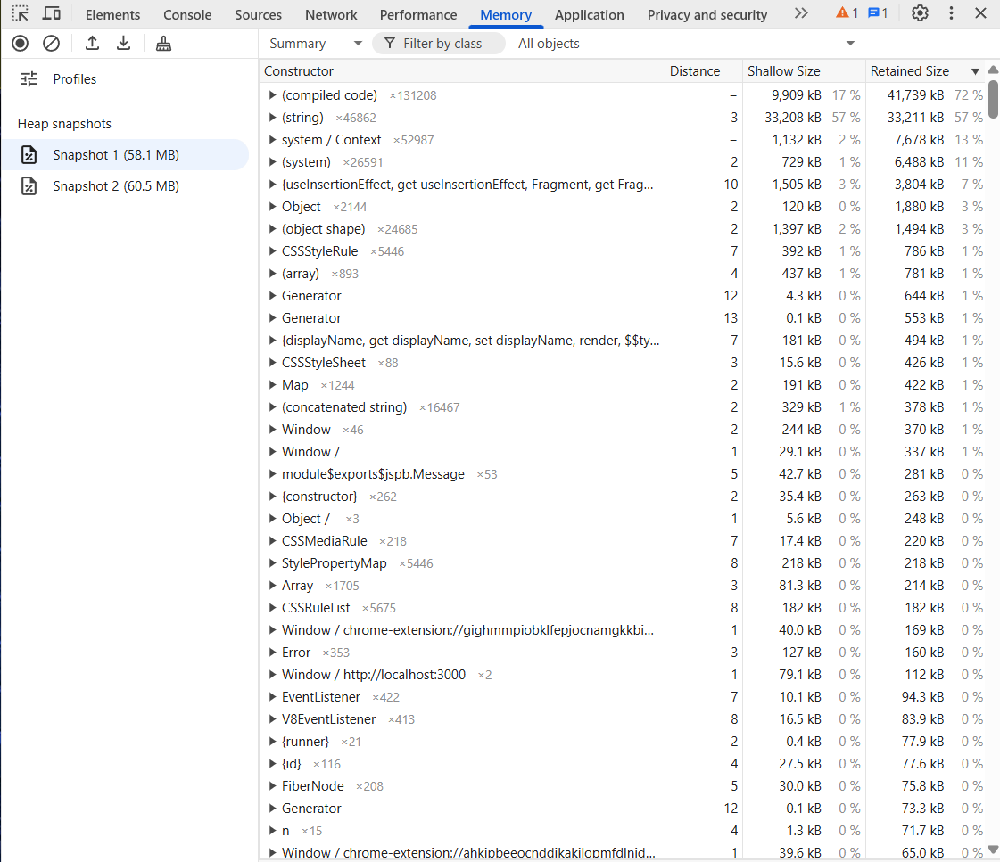
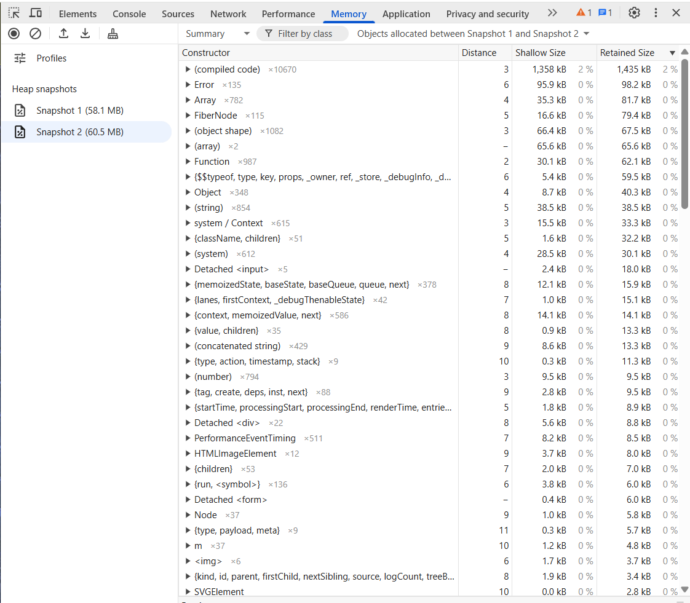
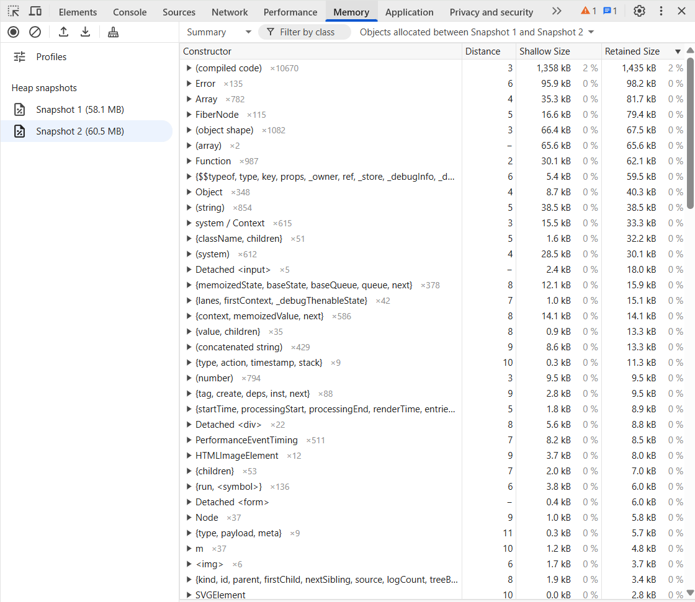
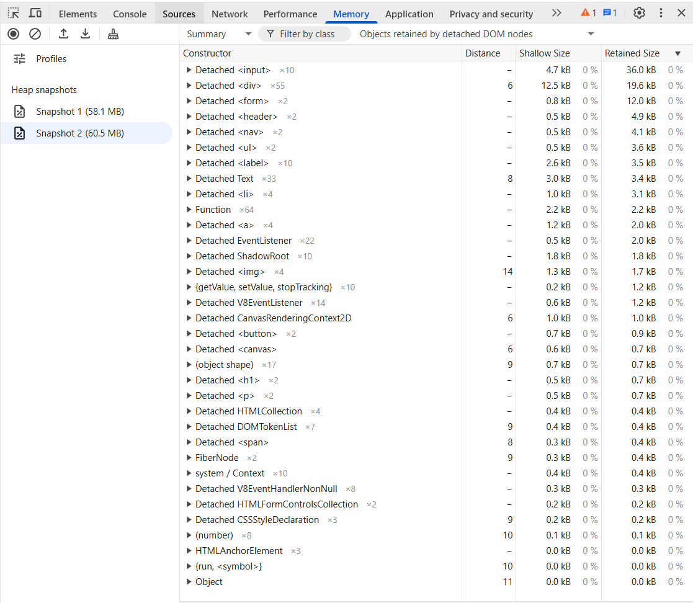

### 1 Snapshot главной страницы непосредственно после запуска приложения.

### 2 Snapshot главной страницы после игра, посещения страниц "Профиль", "Лидерборд", "Форум".

### 3 Разница между 1 и 2 snapshot-ами.

### 4 Скриншот сdetached DOM nodes.

### 5 Оценка результатов измерений.

Анализ Snapshot 1 (58.1 MB) и Snapshot 2 (60.5 MB) показал увеличение на 2.4 MB, из которых подавляющая часть приходится на compiled code. Основные затраты памяти связаны с работой библиотек, установленных в проекте.
